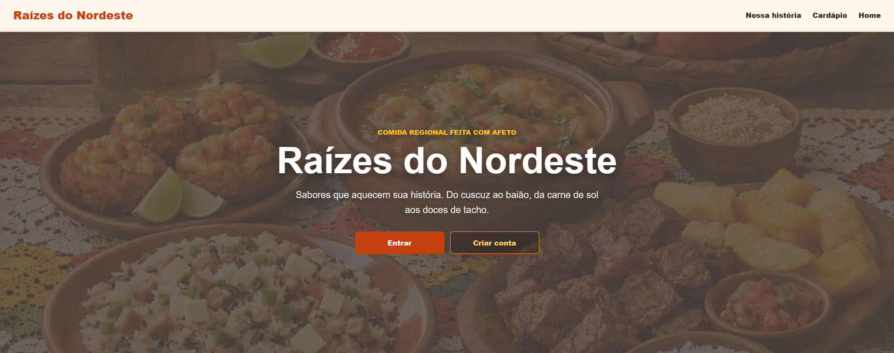
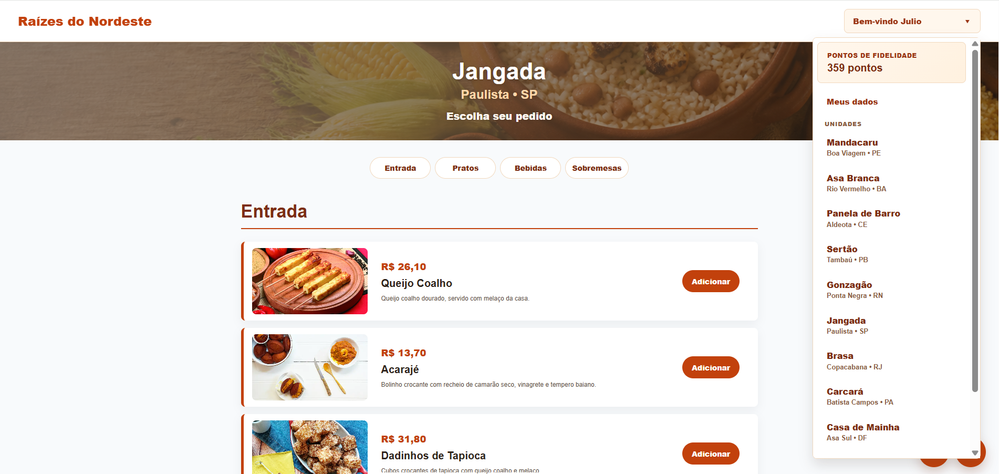
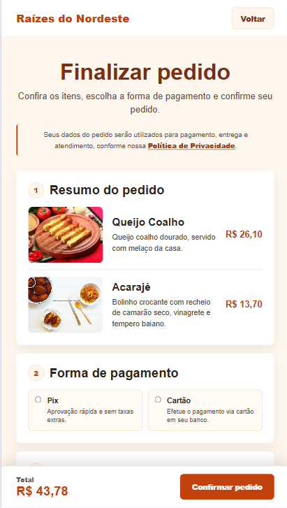
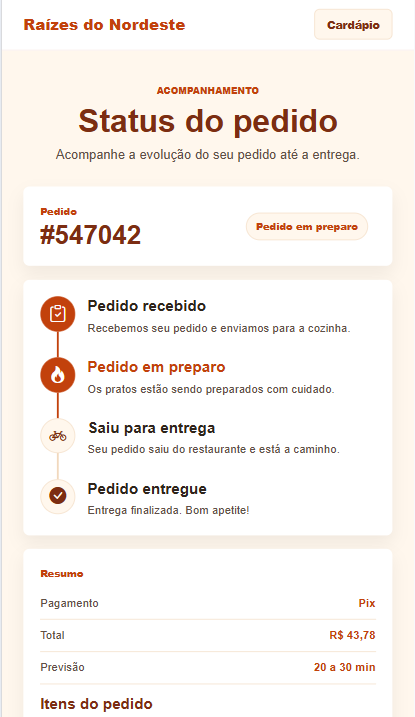

# Raízes do Nordeste

Aplicação web responsiva de delivery inspirada na culinária nordestina. O projeto permite criar uma conta, escolher uma unidade, navegar pelo cardápio, montar um pedido, aplicar benefícios, finalizar a compra e acompanhar o andamento da entrega.

Desenvolvido como projeto acadêmico da **UNINTER**, utilizando apenas tecnologias web nativas.

## Prévia

| Página inicial | Cardápio |
| --- | --- |
|  |  |

| Checkout | Status do pedido |
| --- | --- |
|  |  |

## Funcionalidades

- Página inicial com apresentação da marca e destaques do cardápio;
- cadastro de clientes com aceite dos Termos de Uso e da Política de Privacidade;
- autenticação e proteção das páginas internas;
- edição dos dados cadastrais;
- seleção entre 10 unidades e carregamento do cardápio correspondente;
- produtos organizados por categorias;
- carrinho com inclusão, remoção e cálculo do total;
- checkout com pagamento via Pix ou cartão;
- cupons de desconto, frete grátis e recompensas por fidelidade;
- acúmulo de pontos após a conclusão de pedidos;
- acompanhamento simulado das etapas do pedido;
- painel administrativo com faturamento, pedidos, ticket médio e rankings;
- layout responsivo para mobile, tablet, totem e desktop.

## Tecnologias

- HTML5
- CSS3
- JavaScript (Vanilla JS)
- Web Storage API (`localStorage` e `sessionStorage`)
- Bootstrap Icons via CDN
- Canvas API para o gráfico do painel administrativo

Não há backend ou banco de dados: contas, sessão, carrinho e pedidos são armazenados localmente no navegador.

## Como executar

Clone ou baixe este repositório e abra o projeto por meio de um servidor local.

Com a extensão **Live Server** do Visual Studio Code, clique com o botão direito em `index.html` e selecione **Open with Live Server**.

Também é possível usar o servidor nativo do Python:

```bash
python -m http.server 8000
```

Depois, acesse [http://localhost:8000](http://localhost:8000) no navegador.

> A conexão com a internet é necessária para carregar os ícones fornecidos pelo CDN do Bootstrap Icons.

## Como testar a jornada do cliente

1. Acesse a página inicial e clique em **Criar conta**.
2. Abra os Termos de Uso e a Política de Privacidade para liberar o aceite da LGPD.
3. Preencha o cadastro e entre com a conta criada.
4. Escolha uma unidade no menu do usuário.
5. Adicione produtos ao carrinho e avance para o checkout.
6. Escolha uma forma de pagamento, aplique um cupom se desejar e confirme o pedido.
7. Acompanhe a evolução do pedido na página de status.

Alguns cupons disponíveis para demonstração:

| Cupom | Benefício |
| --- | --- |
| `NORDESTE 10` | 10% de desconto |
| `BEM VINDO` | 10% na primeira compra |
| `FRETE GRATIS` | Remove a taxa de entrega |
| `CLIENTE VIP` | 25% para clientes com pelo menos 500 pontos |

## Acesso administrativo

O painel administrativo utiliza dados fictícios para simular indicadores gerenciais, rankings e auditorias.

- **E-mail:** `admin@raizes.com.br`
- **Senha:** `Admin@123`

## Estrutura do projeto

```text
.
├── assets/             # Imagens da interface, produtos e screenshots
│   └── screenshots/    # Prints usados na prévia do README
├── css/                # Estilos base e adaptações responsivas
├── js/                 # Regras de autenticação, pedidos e interface
│   ├── unidade1.js     # Cardápios das unidades
│   └── ...
├── paginas/            # Telas internas da aplicação
├── index.html          # Página inicial
└── README.md           # Documentação do projeto
```

## Responsividade

O projeto segue uma abordagem mobile-first e utiliza quatro faixas de exibição:

| Dispositivo | Largura |
| --- | --- |
| Mobile | até 479 px |
| Tablet | 480 px a 768 px |
| Totem | 769 px a 1197.98 px |
| Desktop | a partir de 1198 px |

## Observações

- Os dados ficam vinculados ao navegador e à origem em que o projeto foi aberto.
- Limpar os dados do site no navegador remove contas, sessão, carrinho e histórico de pedidos.
- O pagamento e a evolução do pedido são simulações para fins de demonstração.
- Como as senhas são mantidas no `localStorage`, esta implementação é adequada somente para estudo e prototipação. Uma versão de produção exigiria backend, banco de dados e autenticação segura.
